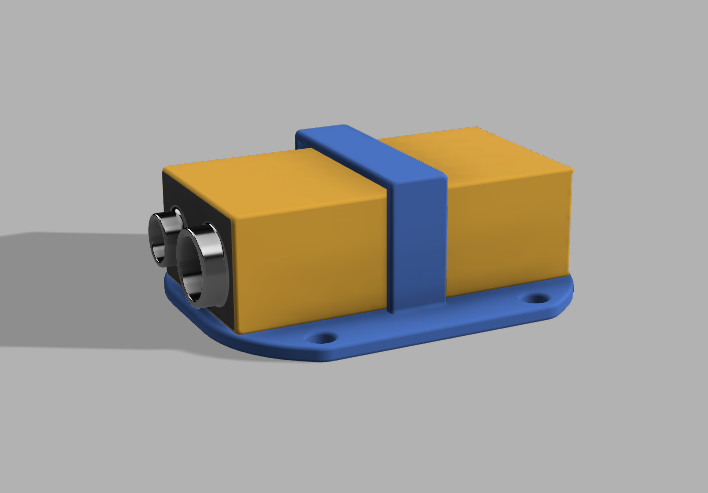
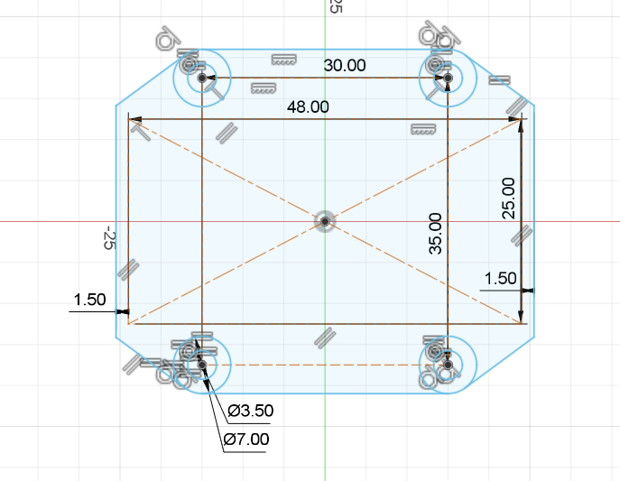
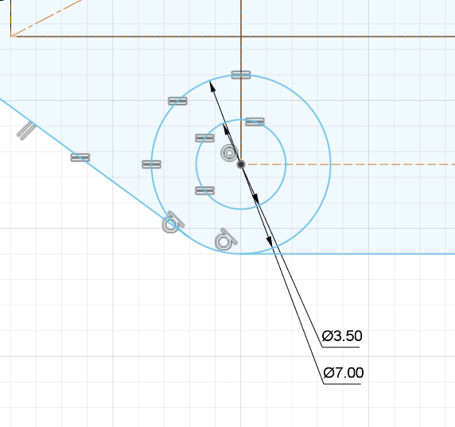

# ⚡ Mechanical Systems

[Download Arduino before next session](https://www.arduino.cc/en/software/)

## 📃 Introduction

In this session, we will be assembling the robot that we will use for the rest of the course.\

[ADD IMAGE OF ALL PARTS ON TABLE]

Sections labelled "**HOW TO**" explain certain techniques, and can be skipped if you are comfortable with them.

If you are going fast then feel free to do the sections labelled "**EXTRA**", otherwise they are fine to skip or leave to the end.

## 🔩 Assembly

`TODO`

##  📏CAD

### Intro to CAD

So CAD stands for "Computer Aided Design", basically getting the computer to do math instead of you. Many tools can do this, Rhino, Blender, Sketchup, Inventor, nTopology, blah blah blah... We are using Fusion360! This is because it is super simple, very powerful and can do a massive range of things. The purpose of this tutorial is not to make you an expert on CAD or Fusion360 but rather to give you an overview of what's possible with lots of tips for you to explore after the workshop.

### Fusion 360!

I started writing up instructions on how to use Fusion360, then I decided to look up how other people have done it and found this great video which did a much better job than I ever could have, especially in text, so if you are viewing this after the workshop, [this is a great resource](https://youtu.be/d3qGQ2utl2A?si=PHY4GxKd013NVEd9&t=152)

From this point onwards it is assumed you have watched that video or followed along in person and also know how a 3D printer operates.

### Design a (bad) battery holder for 3D printing

[Design Files](https://a360.co/3PLLL0S) which you can download to have a look at how this was designed

First step, stop reading in the instructions and think about how you would design a 3D printed battery Holder for a 9V battery.

`1. Understand all dimensions` 

Think of all the important sizes you are designing for, in this case 
- [How big is a 9v battery](https://www.google.com/search?q=how+big+is+a+9v+battery)
- Where and what size are the mounting holes? (m3, 30mm width and 35mm length)
- How Thick do various parts need to be (depends on your design)

All these can be measured or looked up in Google, technical documentation etc

`2: Create a sketch`

Now we have the size of everything we can add it to a 2D drawing just like we learned from the Fusion intro.

You can see all the important dimensions are shown and there are many little grey icons showing [constraints](https://productdesignonline.com/fusion-360-tutorials/how-to-dimension-sketches-in-fusion-360/)

This was made by adding rectangles with the important sizes, giving them dimensions, and then making sure there are offsets so everything fits well.

Here is a corner with dimensions and constraints, you can see how there are many little grey icons, this is because all the other corners are based on this, so we can just change one size and everything else also changes.

`3: Extrude`

The Bigger a 3D print, the longer it takes and the more material is used. So when picking sizes such as how much to extrude we need to take into account many factors:

- Strength
- Time to print and cost
- If bolts will go through
- If it will get in any other parts way
- etc

If we make it super thin to save material and accidentally make it TOO thin, we will need to re-print it which takes a lot more time. For a part like this 2mm should be plenty

`4: Loop`

The bar over the battery will hold it in, this is probably the most difficult part, if it is too big then the battery will just slip out, if it is too small the battery won't fit in. We found the perfect size to be **IDK YET :)**

`5 Design Touches`

Lastly, can add some chamfers, and fillets.

The chamfers are inside the loop and are at a harsh angle so the battery can be pushed in easily. And the fillets are EVERYWHERE (nearly)! Fillets are super useful for many reasons: 

- Firstly they look great! it is a super quick way to make your part look a lot prettier!
- Secondly, they get rid of sharp corners so it makes things nicer to hold and handle.
- Thirdly, it makes things easier to print, in complicated parts heat stresses can be fixed with fillets and on the bottom of a part if you add a 0.5mm fillet you never get an elephant foot on your 3D print; no more needing to clean up slightly too small holes!

The only area that does not have fillets is on the inside of the loop, otherwise, this might make the hole too small for the battery.

**EXTRA**

`6 Add in a Battery`

A super cool feature of Fusion 360 is you can have one design that you can use [inside another](https://help.autodesk.com/view/fusion360/ENU/?guid=ASM-DERIVE), and when you update the original, then the derived ones also updates as well. Previously I made a 9v battery to show how it would fit in. There are many other ways to do this, for example using some [component libraries](https://help.autodesk.com/view/fusion360/ENU/?guid=GUID-90FD5419-A8AF-4A7C-AB1E-75D027077709)

**EXTRA**

`7 The Render tab exists`

If you want to take a pretty photo of the super cool part you made then switch to the render tab by clicking `design` in the top left corner which should show a drop-down menu, change to `render` and have a play-around. 

`8 THIS DESIGN IS BAD😭!`

This is not a good design for quite a few reasons

- It has an overhang which means it will need support to 3D print it, taking longer
- It looks ugly
- There are probably better ways to keep the battery in place
- The base of the plate is using too much material and not doing anything
- etc

So please redesign it using all the skills you have just learned

### ❓ Final Tips

- Ask for help, either from ICRS or the internet, AFTER trying it yourself for **5 min**
- Fillets are nice
- Click random things to see what they do
- Press `s` to search for a function so you don't need to find it in the menus
- Fusion can also do many other things like 3D printing, technical drawings, generative design, simulations etc, its worth looking more into later
- You will forget a lot of this, that's fine, just ask

